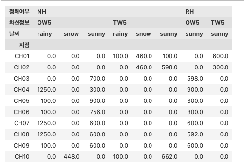
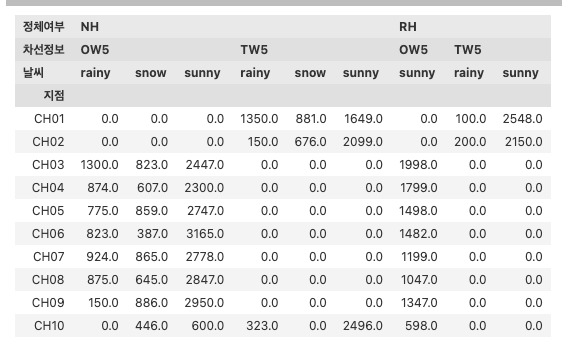
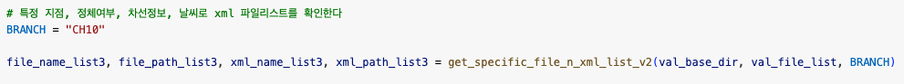
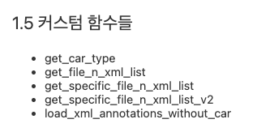
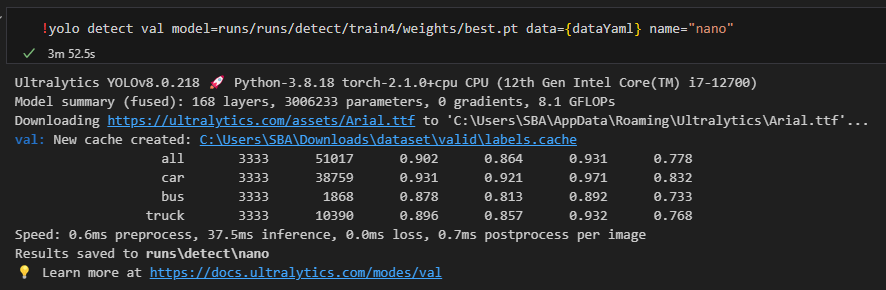
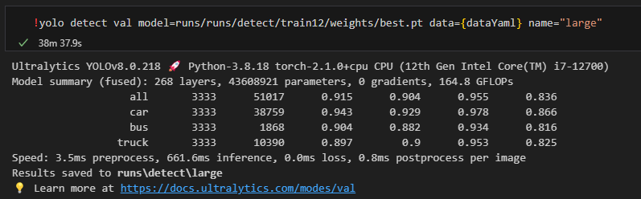

# shin_yolo_repo
shin_yolo_repo

## YOLOV8에서 CCTV 도로 교통 상황 확인
- 로컬과 실제 gcp 가 분리되어 있습니다.
- 환경이 달라서 안되는 부분이 있을 수 있으니 감안 하시고 사용 하시기 바랍니다.

## EDA
- 각 지점별 val의 차량 분포는 아래와 같습니다.

- 각 지점별 train의 차량 분포는 아래와 같습니다.

## 추가 데이터
- 추가 데이터는 위 표를 바탕으로 지점 08번과 지점 10번의 차량 중 버스와 트턱만 추가 하였습니다.
- 추가한 방법은 xml에서 바운딩 박스를 car를 제외하여 txt파일을 생성 하였습니다.

## 그 외 커스텀 함수들을 만들어서 EDA에 필요한 내용들을 확인 하였습니다.

## YOLOv8n 결과
- 01 ~ 04 지점의 car, truck, bus - 25 epoch
- !yolo task=detect mode=train model=yolov8n.pt data=/home/jupyter/cctv_datasets/cctv_storage_20231120/data.yaml epochs=25 imgsz=800 plots=True
- metrics/mAP50-95(B) : 0.78014

## YOLOv8m 결과 1
- 01 ~ 04 지점 -75 epoch
- !yolo task=detect mode=train model=yolov8m.pt data=/home/jupyter/cctv_datasets/cctv_storage_20231120/data.yaml epochs=75 imgsz=800 plots=True batch=16 cache=True
- metrics/mAP50-95(B) : 0.82405

## YOLOv8m 결과 2
- 08, 10 지점의 bus, truck 이미지 약 1만장 추가
- train 데이터의 08, 10 지점의 bus와 truck의 바운드 박스만 처리하여 데이터 추가

- !yolo task=detect mode=train model=yolov8m.pt data=/home/jupyter/cctv_datasets/cctv_storage_20231120/data.yaml epochs=100 imgsz=800 plots=True batch=16 cache=True
- metrics/mAP50-95(B) : 0.8268

- 위 mAP 결과와 동일하나 실제 테스트스 버스 트럭의 검출이 잘됨!!

## YOLOv8l 결과
- !yolo task=detect mode=train model=yolov8l.pt data=/home/jupyter/cctv_datasets/cctv_storage_20231120/data.yaml epochs=100 imgsz=1024 plots=True batch=8 cache=True workers=10
- metrics/mAP50-95(B) : 0.83603

- m 모델보다 predict 시간이 좀더 걸리나, 저녁 CCTV 테스트시 검출이 잘됨
